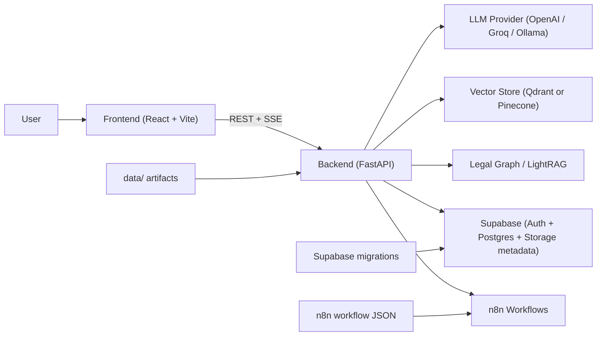

# Nyaya AI Full Project Architecture and Backend Walkthrough

## 1. What this project is

Nyaya AI is an end-to-end legal workflow application focused on Indian criminal-law reasoning over:

- BNS 2023
- BNSS 2023
- BSA 2023

It is not just a chat assistant. The product is structured as a multi-stage case pipeline:

1. Ask a legal question in the assistant.
2. Draft an FIR from facts.
3. Generate an investigation report.
4. Run a courtroom simulation with multiple legal agents.
5. Save case history and appeal-chain judgments.
6. Measure retrieval quality with scheduled evals.

At a high level, the repository combines:

- A React frontend for the user experience.
- A FastAPI backend for orchestration and legal reasoning.
- Supabase for auth, persistence, and evidence storage metadata.
- Qdrant or Pinecone-compatible vector search for legal retrieval.
- A lightweight legal knowledge graph for graph-aware retrieval.
- n8n for workflow automation, approval loops, and scheduled jobs.

## 2. Top-level repository map

| Path | Purpose |
| --- | --- |
| `frontend/` | React app, page routing, auth, streaming UI, case workspace |
| `backend/` | FastAPI API, agents, retrieval, storage access, scripts, tests |
| `data/` | Parsed statutes, enriched sections, graph data, LightRAG SQLite DB |
| `db/` | Original SQL migrations and schema docs |
| `supabase/` | Local Supabase config and active migrations |
| `n8n/` | Automation container assets and workflow JSON files |
| `docs/` | Architecture and evaluation documentation |
| `docker-compose.yml` | Local multi-service stack definition |
| `.env` | Runtime configuration for providers, auth, vector store, and workflows |

## 3. Runtime architecture

### 3.1 Frontend responsibilities

The frontend is responsible for:

- Sign-in and sign-up with Supabase.
- Route-based navigation between Assistant, FIR, Investigation, Trial, History, and Eval pages.
- Streaming assistant responses over SSE.
- Carrying case facts across pages through a local "current case" workspace.
- Direct uploads of evidence binaries to Supabase Storage.

The main entry points are:

- `frontend/src/main.jsx`
- `frontend/src/App.jsx`
- `frontend/src/context/AuthContext.jsx`
- `frontend/src/context/CaseContext.jsx`

### 3.2 Backend responsibilities

The backend is the core reasoning layer. It owns:

- API routing and validation
- user resolution and admin/internal auth
- query classification and routing
- retrieval from vector and graph sources
- agent orchestration
- citation verification
- database persistence
- workflow callbacks and scheduled admin actions

The main app entry point is `backend/app/main.py`.

### 3.3 External systems

#### LLM providers

The backend can switch LLM providers through config:

- OpenAI
- Groq
- Ollama

All providers are normalized behind one provider interface so the rest of the code does not care which vendor is active.

#### Vector store

The codebase currently supports:

- Qdrant
- Pinecone

The current default in code is Qdrant, even though some older docs still mention Pinecone more prominently.

#### Supabase

Supabase provides:

- browser auth
- PostgreSQL persistence
- evidence object storage policies
- row-level security

#### n8n

n8n is used for:

- human-in-the-loop FIR approval
- verdict fan-out notifications
- daily eval scheduling
- weekly graph rebuild scheduling
- workflow-level error handling

## 4. Main user-facing workflows

## 4.1 Assistant workflow

This is the most important request path.

### Streaming path used by the UI

1. The user types a legal question on the Assistant page.
2. The frontend calls `streamAssistant()` and POSTs to `/api/assistant/stream`.
3. FastAPI resolves the current user from the bearer token, or falls back to soft-auth behavior if token verification is unavailable.
4. The backend stores the user message in `chat_history`.
5. The backend loads recent messages for context.
6. A cheap classifier LLM labels the request as `GREETING`, `LEGAL`, or `NON_LEGAL`.
7. If the request is not legal, the backend returns a short canned answer immediately.
8. If the request is legal, the backend calls `retrieve_context()`.
9. `retrieve_context()` runs the legal retrieval pipeline and returns:
   - a context block
   - citations
   - a low-confidence signal
10. The backend emits citation data as an SSE event.
11. The backend streams answer tokens from the LLM as SSE events.
12. The backend stores the assistant reply and citation metadata in `chat_history`.
13. The frontend updates the transcript live and fills the citation panel.

### Non-streaming path used by `/api/assistant`

There is also a second assistant path:

1. The request goes to `/api/assistant`.
2. The backend stores the message and loads history.
3. The same legal/non-legal classifier runs.
4. Legal queries are handed to `query_planner.execute_plan_safe()`.
5. The planner performs:
   - plan
   - execute sub-queries
   - reflect on result quality
   - optionally retry weak sub-queries
   - synthesize the final answer
6. The backend stores the final answer and returns JSON.

This means the repository currently has two assistant implementations:

- a streaming route that uses direct retrieval plus answer generation
- a non-streaming route that uses the richer planning pipeline

That is an important architectural detail when debugging assistant behavior.

## 4.2 FIR workflow

1. The user fills the FIR form.
2. The frontend sends the structured FIR request to `/api/fir`.
3. The backend resolves the effective `user_id`.
4. The FIR agent pulls either:
   - explicit `facts`, or
   - recent conversation history if facts were not provided directly.
5. The FIR agent retrieves legal context from `retrieve_context()`.
6. The LLM drafts a police-style FIR using the form fields and retrieved sections.
7. The backend saves the result to `fir_records`.
8. If FIR approval is enabled, the backend marks the record as `pending_approval` and triggers the n8n approval workflow.
9. n8n eventually calls back into the backend to mark the FIR `approved` or `rejected`.

## 4.3 Investigation workflow

1. The user submits case facts or FIR text on the Investigation page.
2. The frontend POSTs to `/api/investigation`.
3. The backend retrieves legal context from `retrieve_context()`.
4. The investigation LLM returns structured JSON:
   - summary
   - investigation steps
   - evidence
   - witnesses
   - suspects
   - applicable sections
   - risk level
5. The backend validates and normalizes that JSON.
6. The report is stored in `investigations`.
7. The frontend renders it as a structured report instead of prose.

## 4.4 Trial workflow

1. The user submits the combined case facts.
2. The frontend POSTs to `/api/cases/trial`.
3. The backend retrieves context through `retrieve_context()` with an `APPLY_FACTS` hint.
4. The petitioner agent argues first.
5. The opposing agent responds.
6. The rebuttal agent counters the defense.
7. The judge agent produces structured judgment JSON.
8. The verifier extracts cited sections from the judgment and re-checks them against the actual statute text.
9. The backend stores:
   - the latest verdict pointer in `cases`
   - the full court-level verdict in `judgments`
10. The backend optionally triggers an n8n verdict notification workflow.
11. The frontend renders the agent panels, the judgment, the verified citations, and any appeal chain.

## 4.5 Evidence workflow

1. The user uploads files from the Investigation page.
2. The browser uploads binary files directly to Supabase Storage.
3. The frontend then calls `/api/evidence` to store metadata about the file.
4. The backend stores the row in the `evidence` table.
5. Later, the frontend can list evidence, generate signed download URLs, and delete both the storage object and DB row.

## 4.6 Evaluation workflow

1. n8n runs `eval-cron` on a schedule.
2. The workflow calls `/api/admin/run-eval`.
3. The backend launches `python -m eval.runner`.
4. The eval runner sends test queries through `/api/assistant`.
5. The runner measures retrieval hit rate, verified citation rate, and latency.
6. Results are stored in `eval_runs`.
7. The Eval dashboard reads those rows and charts trends over time.

## 5. Retrieval architecture deep dive

This is the most technically distinctive part of the project.

## 5.1 Router stage

`app/services/act_router.py` runs an LLM-only router that returns:

- likely acts (`BNS`, `BNSS`, `BSA`)
- intent
- optional section hint
- whether the act was explicitly named
- low-level keywords
- high-level keywords
- decomposition sub-queries

This router is memoized per query, which reduces repeated routing cost and stabilizes behavior.

## 5.2 Tier 1: direct section lookup

If the user explicitly typed a section, such as `BNS 202`, the system tries deterministic lookup first:

- `section_lookup.lookup_direct(act, number)`

This avoids unnecessary vector search for explicit legal citations.

The direct hit is then enriched with sibling sections from the LightRAG graph.

## 5.3 Tier 2: unified semantic retrieval

If the query is broader than an explicit section reference, the system runs a multi-signal retrieval pipeline.

### Inputs

- original query
- acts from the router
- keywords from the router
- optional sub-queries
- optional `intent_hint`

### Retrieval signals

1. **HyDE expansion**
   - the LLM writes a hypothetical statute-style paragraph for the query
   - the embedding is created from that generated paragraph instead of only the raw user text

2. **Vector search**
   - semantic search over legal sections in Qdrant or Pinecone

3. **BM25**
   - keyword scoring over the candidate pool
   - catches exact-term queries better than embeddings alone

4. **LightRAG low-level path**
   - low-level keywords map to graph entities
   - entity connections surface nearby sections

5. **LightRAG high-level path**
   - high-level themes match community summaries
   - matched communities contribute related sections

6. **Section-hint fallback**
   - if a number was detected but no exact act match existed, the system can still try a number-based lookup across acts

### Fusion and filtering

After collecting candidates, the system:

1. collapses duplicate hits by section number
2. applies weighted reciprocal rank fusion (RRF)
3. optionally runs a relevance judge LLM to drop poor candidates
4. for `APPLY_FACTS` requests, runs an element matcher that checks whether the facts really satisfy the section's elements
5. runs final LLM reranking if the pool is still too large

### Output

The system builds:

- a context block with section text, summaries, punishment, and graph facts
- citation objects for the UI and downstream agents
- a low-confidence flag
- debug metadata

## 5.4 LightRAG and legal graph

The codebase has two graph layers:

### LegalGraph-Lite

`app/services/legal_graph.py` builds a simple graph from:

- structured or regex-detected section cross-references
- same-act and same-category links

This produces `data/legal_graph.json`.

### LightRAG

`app/services/legal_lightrag.py` is a richer SQLite-backed knowledge graph:

- entities
- relationships
- communities
- salience scores
- sibling and neighborhood traversal

This supports the "knowledge graph aware" retrieval path used by `rag.py`.

## 5.5 Citation verification

The project does not trust generated citations blindly.

The verifier:

1. extracts cited sections from the judgment or generated legal text
2. re-retrieves the actual section text from the vector store
3. asks a verifier LLM whether the cited section supports the claim
4. marks each citation as verified or unverified
5. sends that trust signal back to the UI

This is one of the repo's strongest reliability features.

## 5.6 Query planner

The non-streaming assistant path uses `app/services/query_planner.py`.

It runs a plan-execute-reflect-synthesize loop:

1. **Plan**: decompose the user query into one or more sub-queries.
2. **Execute**: run `retrieve_context()` or direct lookup for each sub-query.
3. **Reflect**: judge whether each result is good enough.
4. **Retry**: optionally refine weak sub-queries once.
5. **Synthesize**: combine the sub-results into a final answer with provenance and confidence.

This planner is more expensive but better suited to multi-part legal questions.

## 6. Data model and state

## 6.1 Supabase tables

The main tables are:

| Table | Purpose |
| --- | --- |
| `profiles` | user profile and role metadata |
| `chat_history` | assistant and user messages by `session_id` |
| `fir_records` | generated FIR drafts and approval state |
| `investigations` | structured investigation reports |
| `cases` | latest case-level trial state |
| `judgments` | full appeal-chain verdicts by court level |
| `evidence` | metadata for evidence files stored in Supabase Storage |
| `test_cases` | labeled retrieval test inputs |
| `eval_runs` | evaluation results over time |

## 6.2 Storage bucket

The `evidence` bucket is created in Supabase Storage for uploaded files. The database stores the metadata row, while the actual binary lives in object storage.

## 6.3 Browser-side local state

The frontend keeps a "current case" workspace in localStorage so the user can move between pages without losing context. That workspace holds:

- case facts
- last FIR form
- FIR text
- FIR record id
- investigation report
- case id
- last selected court level

## 6.4 Data artifacts in `data/`

Important local artifacts include:

- `sections_parsed.json`
- `sections_enriched.json`
- `legal_graph.json`
- `data/lightrag/knowledge_graph.db`

These are not just cache files. They are part of the ingest and retrieval architecture.

## 7. Auth, security, and access model

## 7.1 Frontend auth

The frontend uses the Supabase JS client to:

- sign in
- sign up
- persist session
- attach bearer tokens to API requests

## 7.2 Backend auth

The backend resolves the current user through `get_current_user()`:

- in strict mode, missing or invalid token returns 401
- in soft-auth mode, failed verification falls back to an anonymous user

Soft-auth exists because some local setups cannot verify newer Supabase token formats with the backend's current HS256-only verification path.

## 7.3 Row-level security

Supabase migrations enable RLS on the main tables so users are limited to their own records unless admin policies apply.

## 7.4 Admin and internal access

Admin routes allow two access modes:

- authenticated admin user
- shared internal key header from n8n

This is how scheduled eval and graph rebuild workflows call protected backend actions without browser auth.

## 8. Deployment and runtime notes

## 8.1 Local stack

`docker-compose.yml` currently defines:

- `backend`
- `frontend`
- `n8n`
- `qdrant`
- `pinecone-local`

The backend is mounted with hot reload in development.

## 8.2 Provider switching

Both LLM and vector providers are configurable through environment variables. The code tries to keep provider-specific behavior isolated inside service and provider modules.

## 8.3 Known architecture nuance

The repo is in a partially migrated state:

- current runtime defaults favor Qdrant
- some docs and older scripts still emphasize Pinecone
- both services exist in the compose file

That is not necessarily a bug, but it is important context when tracing behavior.

## 9. Backend request map

| Route | Main file | Core implementation |
| --- | --- | --- |
| `/api/health` | `app/routers/health.py` | status, model, graph health |
| `/api/assistant` | `app/routers/assistant.py` | planner-based assistant |
| `/api/assistant/stream` | `app/routers/assistant.py` | streaming assistant |
| `/api/fir` | `app/routers/fir.py` | FIR drafting agent |
| `/api/investigation` | `app/routers/police.py` | investigation agent |
| `/api/cases/trial` | `app/routers/cases.py` | courtroom simulation |
| `/api/conversations` | `app/routers/conversations.py` | chat history sidebar |
| `/api/evidence` | `app/routers/evidence.py` | evidence metadata |
| `/api/cases/{case_id}/judgments` | `app/routers/judgments.py` | appeal chain |
| `/api/eval/*` | `app/routers/evaluation.py` | eval dashboard data |
| `/api/admin/*` | `app/routers/admin.py` | protected maintenance actions |
| `/api/internal/*` | `app/routers/internal.py` | n8n callbacks |

## 10. Backend file-by-file walkthrough

This section is grouped by folder so it stays readable while still covering every backend file.

## 10.1 Backend root files

| File | Role | Notes |
| --- | --- | --- |
| `backend/.dockerignore` | Docker build hygiene | Keeps unnecessary files out of the backend image context. |
| `backend/Dockerfile` | Backend container image | Defines how FastAPI is packaged for container runs. |
| `backend/requirements.txt` | Python dependency manifest | Includes FastAPI, Supabase, Qdrant, Pinecone, BM25, jose, tests, and graph libs. |
| `backend/runtime.txt` | Runtime hint | Useful for hosted Python environments that inspect runtime version files. |

## 10.2 `backend/app/`

| File | Role | Notes |
| --- | --- | --- |
| `backend/app/__init__.py` | Package marker | Marks `app` as the main Python package. |
| `backend/app/config.py` | Environment-driven settings | Central place for provider, auth, storage, and workflow configuration. |
| `backend/app/main.py` | FastAPI entrypoint | Creates the app, configures CORS, and mounts all routers. |

## 10.3 `backend/app/agents/`

| File | Role | Notes |
| --- | --- | --- |
| `backend/app/agents/__init__.py` | Package marker | Groups the domain-specific agent modules. |
| `backend/app/agents/assistant.py` | Non-streaming assistant logic | Persists chat, classifies intent, and runs the query planner for legal questions. |
| `backend/app/agents/courtroom.py` | Trial orchestrator | Runs petitioner, opposing, rebuttal, judge, and citation verification. |
| `backend/app/agents/fir.py` | FIR drafting agent | Uses retrieved legal context plus structured complainant data to draft an FIR. |
| `backend/app/agents/police.py` | Investigation agent | Produces normalized JSON investigation reports. |
| `backend/app/agents/verifier.py` | Citation auditing layer | Extracts cited sections and verifies them against actual statute text. |

## 10.4 `backend/app/core/`

| File | Role | Notes |
| --- | --- | --- |
| `backend/app/core/__init__.py` | Package marker | Organizes shared backend core utilities. |
| `backend/app/core/security.py` | Auth dependency layer | Decodes Supabase JWTs, exposes current-user dependency, and supports strict vs soft-auth modes. |

### `backend/app/core/llm/`

| File | Role | Notes |
| --- | --- | --- |
| `backend/app/core/llm/__init__.py` | LLM package exports | Re-exports `LLMProvider`, `LLMMessage`, and `get_llm`. |
| `backend/app/core/llm/base.py` | Provider abstraction | Defines the provider interface, streaming fallback, and JSON repair helper. |
| `backend/app/core/llm/factory.py` | Provider selector | Builds the configured provider singleton from settings. |
| `backend/app/core/llm/openai_compatible.py` | OpenAI/Groq provider | Handles OpenAI-compatible chat APIs, including streaming and GPT-5 payload quirks. |
| `backend/app/core/llm/ollama_provider.py` | Ollama provider | Supports fully local chat completion and streaming through Ollama. |

## 10.5 `backend/app/prompts/`

| File | Role | Notes |
| --- | --- | --- |
| `backend/app/prompts/__init__.py` | Package marker | Groups prompt-related modules. |
| `backend/app/prompts/templates.py` | System prompt catalog | Stores prompt templates for classifier, assistant, FIR, investigator, courtroom roles, and verifier. |

## 10.6 `backend/app/routers/`

| File | Role | Notes |
| --- | --- | --- |
| `backend/app/routers/__init__.py` | Router namespace module | Package boundary for API route files. |
| `backend/app/routers/admin.py` | Protected maintenance endpoints | Runs graph rebuilds, eval jobs, and graph stats checks. |
| `backend/app/routers/assistant.py` | Assistant HTTP API | Exposes JSON and streaming assistant routes. |
| `backend/app/routers/cases.py` | Trial routes | Starts trials and fetches case rows. |
| `backend/app/routers/conversations.py` | Chat-history sidebar API | Lists, loads, and deletes conversations grouped by `session_id`. |
| `backend/app/routers/evaluation.py` | Eval dashboard API | Serves recent and latest eval runs. |
| `backend/app/routers/evidence.py` | Evidence metadata API | Creates, lists, and deletes evidence rows. |
| `backend/app/routers/fir.py` | FIR route | Calls the FIR agent and optionally launches approval workflow. |
| `backend/app/routers/health.py` | Health route | Reports runtime status, model config, and graph stats. |
| `backend/app/routers/internal.py` | Internal callback surface | Lets n8n update FIR approval state and exposes FIR status polling. |
| `backend/app/routers/judgments.py` | Appeal-chain route | Lists all stored judgments for a case. |
| `backend/app/routers/police.py` | Investigation route | Wraps the investigation agent with request validation and auth. |

## 10.7 `backend/app/schemas/`

| File | Role | Notes |
| --- | --- | --- |
| `backend/app/schemas/__init__.py` | Package marker | Groups shared request and response models. |
| `backend/app/schemas/models.py` | Pydantic contracts | Defines all request and response schemas for assistant, FIR, investigation, trial, and citations. |

## 10.8 `backend/app/services/`

| File | Role | Notes |
| --- | --- | --- |
| `backend/app/services/__init__.py` | Service namespace module | Package boundary for backend services. |
| `backend/app/services/act_router.py` | Query routing service | Uses an LLM to infer acts, intent, keywords, section hints, and decomposition. |
| `backend/app/services/db.py` | Supabase persistence adapter | Saves and fetches chat, FIRs, investigations, cases, evidence, and judgments. |
| `backend/app/services/embeddings.py` | Embedding provider layer | Creates vectors through Ollama, OpenAI, or sentence-transformers. |
| `backend/app/services/legal_graph.py` | LegalGraph-Lite builder/query layer | Creates and reads the simple section adjacency graph. |
| `backend/app/services/legal_lightrag.py` | Rich legal KG engine | Manages entities, relationships, communities, graph traversal, and sibling discovery. |
| `backend/app/services/n8n.py` | Webhook client | Posts non-blocking events to n8n workflows. |
| `backend/app/services/query_planner.py` | Planner pipeline | Implements plan -> execute -> reflect -> retry -> synthesize for assistant queries. |
| `backend/app/services/rag.py` | Main retrieval engine | Runs routing, direct lookup, semantic retrieval, graph expansion, RRF, filtering, and final payload construction. |
| `backend/app/services/rerank.py` | Retrieval utilities | Implements BM25 and reciprocal rank fusion helpers. |
| `backend/app/services/section_lookup.py` | Deterministic section lookup | Reads `sections_enriched.json` and supports exact act+section lookup. |
| `backend/app/services/vector_store.py` | Vector-store adapter | Reads from Qdrant or Pinecone using shared retrieval shape. |

## 10.9 `backend/eval/`

| File | Role | Notes |
| --- | --- | --- |
| `backend/eval/__init__.py` | Package marker | Groups evaluation tooling. |
| `backend/eval/runner.py` | Eval harness | Executes labeled assistant queries, computes metrics, and stores `eval_runs`. |
| `backend/eval/test_cases.json` | Eval dataset | Hand-curated retrieval test cases and expected sections. |

## 10.10 `backend/scripts/`

These files are mostly ingest, graph-build, seed, and smoke-test utilities.

| File | Role | Notes |
| --- | --- | --- |
| `backend/scripts/build_communities.py` | Community builder for LightRAG | Detects entity communities and writes summary themes to the KG. |
| `backend/scripts/build_graph.py` | LegalGraph builder | Generates `legal_graph.json` from enriched sections or fallback vector metadata. |
| `backend/scripts/build_lightrag.py` | LightRAG v1 builder | Older KG extraction path with direct LLM entity and relationship extraction. |
| `backend/scripts/build_lightrag_v2.py` | LightRAG v2 builder | Current richer KG build path that trusts enriched entities and structured cross-references first. |
| `backend/scripts/chunk_pdfs.py` | Gazette PDF chunker | Spatially parses the legal PDFs into section-level records. |
| `backend/scripts/enrich_sections.py` | Enricher v1 | Adds summaries, questions, punishments, cross-references, and entities to parsed sections. |
| `backend/scripts/enrich_sections_v2.py` | Enricher v2 | Improved enrichment with anti-hallucination cross-reference validation and tighter entities. |
| `backend/scripts/ingest_pdfs.py` | Full PDF ingest pipeline | Earlier end-to-end ingest path for Pinecone-oriented workflows. |
| `backend/scripts/parse_pdfs_llm.py` | Alternative LLM-first parser | Lets the LLM parse PDF chunks into structured sections directly. |
| `backend/scripts/seed_pinecone_v2.py` | Pinecone seed script v2 | Seeds multi-vector section representations into Pinecone. |
| `backend/scripts/seed_pinecone_v3.py` | Pinecone seed script v3 | Adds summary vectors and evolves the Pinecone ingest shape. |
| `backend/scripts/seed_qdrant.py` | Small Qdrant seed script | Seeds a curated set of sections for local demos and eval coverage. |
| `backend/scripts/seed_qdrant_full.py` | Full Qdrant seed script | Loads the full enriched corpus into Qdrant. |
| `backend/scripts/smoke_test_e2e.py` | End-to-end smoke test | Exercises assistant, FIR, investigation, and trial APIs. |
| `backend/scripts/smoke_test_planner.py` | Planner smoke test | Runs representative assistant queries through the planner pipeline. |

### Script lineage note

Not every script is equally current. The repo shows evolution over time:

- `*_v2.py` and `*_v3.py` scripts are usually newer than the base versions.
- Qdrant seed scripts reflect the newer local-first vector path.
- Pinecone scripts remain useful for cloud or legacy deployments.

## 10.11 `backend/tests/`

| File | Role | Notes |
| --- | --- | --- |
| `backend/tests/__init__.py` | Package marker | Groups the backend test suite. |
| `backend/tests/conftest.py` | Pytest bootstrap | Ensures the `app` package is importable when tests run from repo root. |
| `backend/tests/test_graph.py` | LegalGraph tests | Validates reference extraction, adjacency building, and graph file usage. |
| `backend/tests/test_json_repair.py` | LLM JSON repair tests | Validates `_strip_json()` behavior against fences, think blocks, and stray prose. |
| `backend/tests/test_rerank.py` | RRF tests | Confirms reciprocal rank fusion behavior. |
| `backend/tests/test_verifier.py` | Verifier extraction tests | Confirms section extraction from generated legal text. |

## 11. How the frontend, backend, and data layers connect

### Frontend to backend

- `frontend/src/api/client.js` is the main bridge.
- It attaches auth headers when available.
- It exposes regular JSON requests plus SSE streaming for the assistant.

### Backend to database

- `app/services/db.py` is the main persistence gateway.
- Most routers and agents avoid direct Supabase calls and go through this service.

### Backend to retrieval data

- `rag.py` depends on:
  - `act_router.py`
  - `vector_store.py`
  - `embeddings.py`
  - `section_lookup.py`
  - `legal_graph.py`
  - `legal_lightrag.py`
  - `rerank.py`

### Backend to workflows

- `app/services/n8n.py` sends webhook events.
- `app/routers/internal.py` receives workflow callbacks.
- `app/routers/admin.py` exposes scheduled maintenance actions.

## 12. Suggested reading order for new contributors

If you are onboarding to this repo, the cleanest order is:

1. `backend/app/main.py`
2. `backend/app/config.py`
3. `backend/app/routers/assistant.py`
4. `backend/app/agents/assistant.py`
5. `backend/app/services/rag.py`
6. `backend/app/services/act_router.py`
7. `backend/app/services/section_lookup.py`
8. `backend/app/services/legal_lightrag.py`
9. `backend/app/agents/courtroom.py`
10. `backend/app/agents/verifier.py`
11. `backend/app/services/db.py`
12. `supabase/migrations/*.sql`
13. `n8n/workflows/README.md`

That order gives the fastest path from user request to data layer and then to automation.

## 13. Short summary

Nyaya AI is best understood as a legal workflow platform with a retrieval-heavy backend.

The main architecture pattern is:

- React frontend for UX
- FastAPI backend for orchestration
- configurable LLM providers for generation
- vector plus graph retrieval for legal grounding
- Supabase for auth and persistence
- n8n for integration workflows

The backend itself is organized cleanly into:

- routers for HTTP boundaries
- agents for domain behavior
- services for retrieval, storage, and workflows
- core utilities for auth and provider abstractions
- scripts for ingest and maintenance
- tests for critical retrieval and parsing helpers

The most important thing to remember is that legal quality in this repo depends less on a single prompt and more on the interaction between:

- the query router
- the retrieval pipeline
- the graph layers
- the verification layer
- the persistence and workflow surfaces around them

That is the real architecture of the project.
