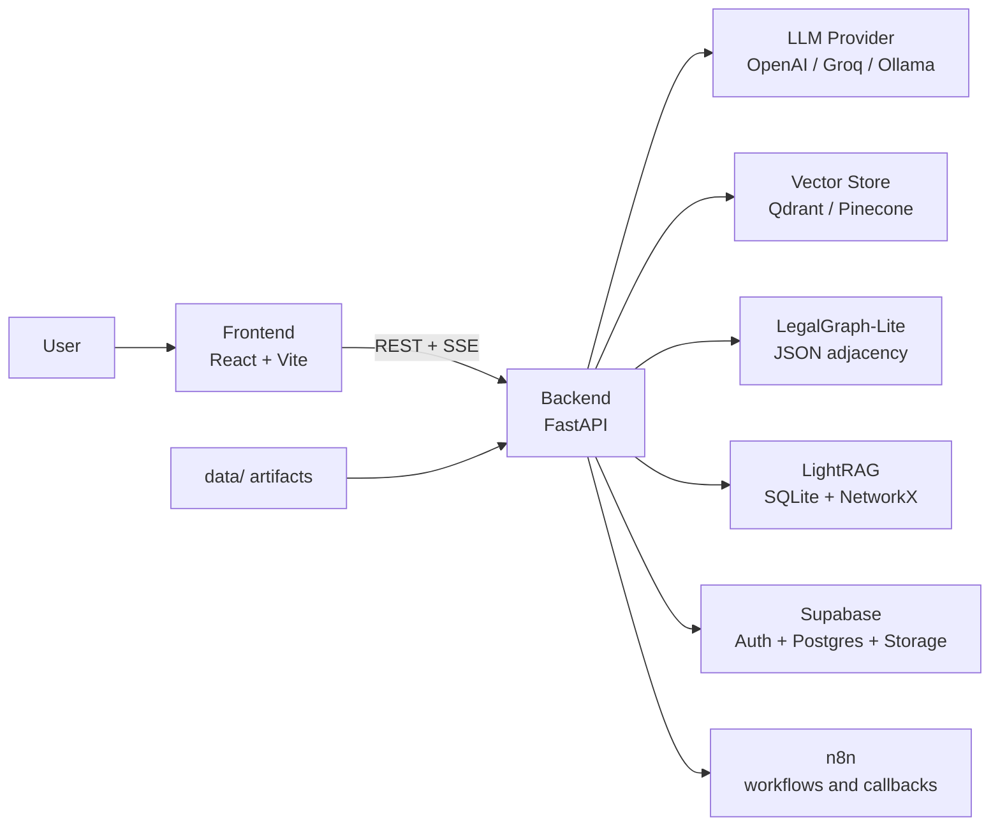

# Nyaya AI Codebase Architecture and Backend Walkthrough

## Scope

This document is a code-driven architecture guide for the current repository state.
It is written from the actual source under `backend/`, `frontend/`, `supabase/`,
`n8n/`, and the runtime config files, not just from the older high-level docs.

The main goal is onboarding: after reading this, a new developer should understand:

- what the project does end to end
- how requests move through the system
- how retrieval, agents, persistence, auth, and automation fit together
- what each backend file is responsible for
- where the important operational and architectural nuances live

## 1. What This Project Is

Nyaya AI is an Indian legal workflow platform built around BNS 2023, BNSS 2023,
and BSA 2023. It is not only a chatbot. The product supports a full case journey:

1. Ask a legal question in a grounded assistant.
2. Draft an FIR from facts.
3. Generate a structured police investigation report.
4. Simulate a courtroom process with multiple legal roles.
5. Store case history, judgments, and appeal-chain decisions.
6. Support role-based lawyer and judge analysis workflows.
7. Measure retrieval quality through scheduled evaluations.

The distinctive engineering idea in this codebase is that legal generation is
not trusted by itself. The backend combines:

- deterministic statute lookup
- vector retrieval
- lightweight graph-aware retrieval
- multi-step query planning for assistant questions
- post-generation citation verification

That combination is the real architecture of the product.

## 2. Top-Level Repository Map

| Path | Purpose |
| --- | --- |
| `backend/` | FastAPI application, legal agents, retrieval engine, eval runner, ingest scripts, tests |
| `frontend/` | React/Vite UI, auth handling, streaming assistant UX, FIR/investigation/trial pages |
| `data/` | Parsed and enriched statute artifacts, LightRAG SQLite DB, graph data |
| `supabase/` | Active database/storage/RLS migrations and local Supabase config |
| `db/` | Earlier schema docs and mirrored migration set |
| `n8n/` | Automation image assets, workflow JSON, approval workflow docs |
| `docs/` | Existing architecture and evaluation docs, plus this walkthrough |
| `docker-compose.yml` | Local multi-service stack for backend, frontend, n8n, and Qdrant |
| `render.yaml` | Render deployment blueprint for the backend |

## 3. Runtime Architecture

### 3.1 Frontend responsibilities

The frontend is responsible for:

- authentication through Supabase
- route-based navigation across assistant, FIR, investigation, trial, history, admin, lawyer, and judge pages
- streaming assistant responses over SSE-over-POST
- keeping a per-user “current case” workspace in local storage
- direct evidence uploads to Supabase Storage
- calling the backend through a thin API client

Key files:

- `frontend/src/App.jsx`
- `frontend/src/context/AuthContext.jsx`
- `frontend/src/context/CaseContext.jsx`
- `frontend/src/api/client.js`
- `frontend/src/lib/sse.js`

### 3.2 Backend responsibilities

The backend owns the product’s reasoning and orchestration logic:

- HTTP routing and validation
- auth resolution and role checks
- retrieval orchestration
- assistant planning and synthesis
- FIR drafting, investigation planning, courtroom simulation
- citation verification
- persistence into Supabase
- automation handoffs to n8n
- eval triggering and graph rebuild operations

The main entry point is `backend/app/main.py`.

### 3.3 Storage and external systems

The current runtime touches four kinds of storage:

- Supabase Postgres for product state
- Supabase Storage for uploaded evidence files
- Qdrant or Pinecone for vector retrieval
- local `data/` artifacts for enriched sections, graph JSON, and LightRAG SQLite

## 4. Main Product Flows

## 4.1 Assistant flow

There are two assistant implementations in the backend.

### Streaming assistant: `/api/assistant/stream`

Used by the live chat UI.

1. Save the user message into `chat_history`.
2. Load recent chat history.
3. Run a cheap classifier prompt to label the message as `GREETING`, `LEGAL`, or `NON_LEGAL`.
4. If not legal, return a canned response immediately.
5. If legal, call `retrieve_context()` with `top_k=4`.
6. Emit citation payloads as SSE.
7. Stream answer tokens from the LLM.
8. Save the assistant answer with metadata such as citations and low-confidence flag.

This path is retrieval-first and optimized for interactivity.

### Non-streaming assistant: `/api/assistant`

Used by the JSON endpoint and the eval runner.

1. Save the user message and load recent history.
2. Run the same cheap classifier.
3. For legal requests, call `query_planner.execute_plan_safe()`.
4. The planner does plan -> execute -> reflect -> synthesize.
5. Save the final answer and return JSON.

This path is more agentic and more expensive, but better for multi-part legal questions.

## 4.2 FIR flow

1. Frontend posts structured FIR data to `/api/fir`.
2. The FIR agent resolves facts from direct input or chat history.
3. It retrieves legal context through `retrieve_context()`.
4. It drafts the FIR using the `FIR_DRAFTER` prompt.
5. It stores the result in `fir_records`.
6. If FIR approval is enabled, the route marks the record `pending_approval` and sends it to n8n.
7. n8n later calls the internal callback route to approve or reject the FIR.

## 4.3 Investigation flow

1. Frontend posts case facts to `/api/investigation`.
2. The investigation agent retrieves legal context.
3. The LLM returns structured JSON.
4. The result is coerced into a stable schema and validated with Pydantic.
5. The report is stored in `investigations`.

## 4.4 Trial flow

1. Frontend posts full case facts to `/api/cases/trial`.
2. The trial agent calls `retrieve_context()` with `intent_hint="APPLY_FACTS"` and a larger `top_k`.
3. It runs petitioner, defence, cross-examination, rebuttal, and judge prompts.
4. It verifies the cited sections against the actual statute text.
5. It stores the latest case state in `cases`.
6. It upserts the level-specific verdict into `judgments`.
7. It also stores a trial transcript snapshot in `chat_history` under `trial_{case_id}`.
8. The route optionally notifies n8n about the verdict.

## 4.5 Lawyer and judge analysis flows

These are separate role-restricted surfaces layered on top of the shared retrieval engine.

### Lawyer analysis

- Route: `/api/lawyer/analyze`
- Uses retrieval plus the `LAWYER_ANALYSIS` prompt
- Verifies citations in the generated strengths and weaknesses
- Stores the exchange in `chat_history` with a `lawyer_` session prefix

### Judge analysis

- Route: `/api/judge/analyze`
- Uses retrieval plus precedent retrieval from the case-laws vector collection
- Uses the `JUDGE_ANALYSIS` prompt
- Verifies citations in the preliminary judicial analysis
- Stores the exchange in `chat_history` with a `judge_` session prefix

The judge surface also supports:

- listing and claiming cases
- submitting human verdict overrides
- fetching similar precedent cases
- searching the precedent case-law collection

## 4.6 Bare Acts flow

The bare-acts explorer does not use vector search. It reads directly from the
enriched statute JSON through `section_lookup.py`.

This is important architecturally because it provides a deterministic, document-like
statute browsing surface independent of the assistant RAG stack.

## 4.7 Evidence flow

Evidence upload is split across frontend and backend:

1. The browser uploads file binaries directly to Supabase Storage.
2. The backend only stores the metadata row in the `evidence` table.
3. Evidence listing and deletion operate on the metadata table.
4. File-object lifecycle is partly frontend-owned and partly DB-owned.

## 4.8 Evaluation and admin flow

The system has an operational maintenance layer:

- `/api/admin/rebuild-graph` runs the graph builder script
- `/api/admin/run-eval` runs the eval runner
- `/api/eval/runs` and `/api/eval/latest` expose read-only metrics for the dashboard

n8n uses these admin routes for scheduled jobs.

## 5. Backend Architecture by Layer

| Layer | Main files | Responsibility |
| --- | --- | --- |
| App bootstrap | `app/main.py`, `app/config.py` | Create FastAPI app, load settings, mount routers |
| Auth and roles | `app/core/security.py` | Resolve current user, support soft-auth, enforce admin/lawyer/judge access |
| LLM abstraction | `app/core/llm/*` | Normalize OpenAI, Groq, and Ollama behind one provider interface |
| Prompts | `app/prompts/templates.py` | Keep all system prompts centralized and editable |
| Schemas | `app/schemas/models.py` | Shared request/response data contracts |
| Routers | `app/routers/*` | HTTP boundary, auth checks, route-specific orchestration |
| Agents | `app/agents/*` | Domain workflows: assistant, FIR, police, courtroom, verifier |
| Retrieval services | `app/services/rag.py`, `act_router.py`, `vector_store.py`, `legal_graph.py`, `legal_lightrag.py`, `section_lookup.py`, `rerank.py` | Query routing, retrieval, graph expansion, reranking, lookup |
| Persistence and integrations | `app/services/db.py`, `n8n.py` | Supabase writes/reads and webhook posting |
| Eval and scripts | `eval/*`, `scripts/*` | Offline ingest, graph building, seeding, smoke tests, evaluation |

## 6. Retrieval and Reasoning Deep Dive

This is the technical heart of the backend.

## 6.1 Query routing: `act_router.py`

The router is LLM-only. It does not regex-parse the user query by itself.
It returns:

- likely acts
- intent
- an optional `section_hint`
- whether the act was explicitly named
- low-level keywords
- high-level keywords
- sub-queries

Important design intent:

- safer handling of dates, ages, and money values so they are not mistaken for section numbers
- memoization so identical queries do not get rerouted unpredictably
- richer output for LightRAG and decomposition

## 6.2 Deterministic section lookup: `section_lookup.py`

Before semantic search, the system tries direct lookups when the user clearly
references a section. This reads `sections_enriched.json` into an in-memory index.

This module powers:

- direct assistant/trial citation lookups
- bare-acts browsing
- deterministic fallback for section-number searches
- metadata enrichment for retrieved records

## 6.3 Unified semantic retrieval: `rag.py`

When direct lookup is not enough, `retrieve_context()` runs a multi-signal retrieval pipeline.

### Stage A: router and direct-lookup gate

- call `route_query()`
- if act is explicit and section number is explicit, try direct lookup first
- if that succeeds, enrich the result with KG siblings and return early

### Stage B: semantic fan-out

For broader queries, `_semantic_retrieve()` runs:

- HyDE expansion on each sub-query
- vector search across the active vector store
- LightRAG low-level graph retrieval
- LightRAG high-level community retrieval
- optional section-number fallback lookup
- BM25 over the candidate pool
- weighted reciprocal rank fusion

### Stage C: noise reduction

After fusion, the engine can apply:

- an LLM relevance judge
- an element matcher for fact-application queries
- a final LLM reranker

### Stage D: answer context assembly

The final payload contains:

- a context string for the answering LLM
- citation objects for the UI
- graph-derived related sections
- optional graph facts and community summaries
- a low-confidence signal
- debug metadata

## 6.4 LegalGraph-Lite: `legal_graph.py`

This is the simpler graph layer.

It builds a JSON adjacency map from:

- explicit or regex-detected section references
- same-act/same-category co-membership buckets

Its job is cheap structural expansion around statute sections.

## 6.5 LightRAG: `legal_lightrag.py`

This is the richer graph system.

It stores:

- legal entities
- typed relationships
- community assignments
- community summaries and keywords
- salience values

It uses SQLite for storage and NetworkX for traversal.

Its most important runtime capabilities are:

- `local_subgraph()` for salience-weighted entity-neighbor traversal
- `get_section_siblings()` for section-related neighbors in direct lookup mode
- `neighbour_sections()` for low-keyword and high-theme graph retrieval

## 6.6 Query planner: `query_planner.py`

The planner is a second orchestration layer used only by the non-streaming assistant.

It performs:

1. planning
2. sub-query execution
3. reflection on answer quality
4. optional retry of weak sub-queries
5. final synthesis

This means assistant behavior depends on both:

- the retrieval engine
- the planner that decides how to use the retrieval engine

## 6.7 Citation verification: `agents/verifier.py`

The verifier is the trust layer.

It:

- extracts cited sections from generated text
- re-retrieves the actual section from the vector store
- asks a verifier prompt whether the section supports the claim
- returns `verified`, `verify_note`, and optionally a likely-corrected citation

This is especially important for trial outputs and lawyer/judge analysis.

## 7. State, Storage, and Data Artifacts

## 7.1 Supabase tables

| Table | Purpose |
| --- | --- |
| `profiles` | user identity metadata and role |
| `chat_history` | assistant, lawyer, judge, and trial transcript history grouped by `session_id` |
| `fir_records` | drafted FIRs plus approval state |
| `investigations` | structured investigation reports |
| `cases` | latest case-level state and human-override fields |
| `judgments` | one verdict row per case per court level |
| `evidence` | metadata for evidence files stored in Supabase Storage |
| `test_cases` | retrieval evaluation inputs |
| `eval_runs` | aggregated eval metrics and per-case details |

## 7.2 Local data artifacts

| Path | Meaning |
| --- | --- |
| `data/sections_parsed.json` | chunked section-level statute records from PDF parsing |
| `data/sections_enriched.json` | enriched statute corpus with summaries, punishments, refs, entities |
| `data/legal_graph.json` | persisted LegalGraph-Lite adjacency graph |
| `data/lightrag/knowledge_graph.db` | SQLite-backed LightRAG knowledge graph |

## 7.3 Vector collections

The code currently supports both Qdrant and Pinecone:

- legal statutes collection
- case-laws collection for precedent retrieval

Current default in code is Qdrant.

## 7.4 Automation layer

n8n is used for:

- FIR approval workflow
- verdict fan-out notifications
- eval scheduling
- graph rebuild scheduling
- error handling
- a sample “agent as workflow” pattern

## 8. Auth, Roles, and Access Model

## 8.1 Frontend auth

Frontend auth is Supabase-based. `AuthContext`:

- resolves the current session
- fetches the user role from `profiles`
- supports sign in / sign up / sign out
- falls back to demo mode if Supabase is not configured

## 8.2 Backend auth

`core/security.py` resolves a `CurrentUser` object from the bearer token.

It supports two modes:

- strict mode: invalid or missing token becomes `401`
- soft-auth mode: invalid or unverifiable token falls back to an anonymous user

Soft-auth exists because some local setups cannot verify newer Supabase token formats using the current backend verification path.

## 8.3 Role checks

Role-protected surfaces are enforced with:

- `require_admin`
- `require_lawyer`
- `require_judge`

Judge and lawyer dashboards therefore rely on both frontend role handling and backend authorization.

## 8.4 Row-level security

Supabase migrations enable RLS on main tables.
The backend uses the service-role key so it can act as the trusted middle tier.

## 9. Deployment and Operations

## 9.1 Local Docker stack

`docker-compose.yml` runs:

- backend
- frontend
- n8n
- Qdrant

Important details:

- backend mounts `app/`, `scripts/`, `eval/`, `tests/`, and `data/` for live development
- frontend proxies `/api` to the backend through nginx
- n8n gets environment variables needed for approvals and scheduled jobs

## 9.2 Backend container

The backend image is a slim Python 3.12 container that installs requirements,
copies app code, exposes port 8000, and runs `uvicorn`.

## 9.3 Hosted deployment

`render.yaml` defines a Render backend service and currently favors:

- `LLM_PROVIDER=openai`
- `OPENAI_MODEL=gpt-5-nano`
- `EMBEDDINGS_PROVIDER=openai`
- `EMBEDDINGS_MODEL=text-embedding-3-small`

## 10. Current Backend Route Map

| Route | File | Responsibility |
| --- | --- | --- |
| `GET /api/health` | `app/routers/health.py` | service and graph status |
| `POST /api/assistant` | `app/routers/assistant.py` | planner-based assistant |
| `POST /api/assistant/stream` | `app/routers/assistant.py` | SSE assistant |
| `GET /api/bare-acts/` | `app/routers/bare_acts.py` | list acts |
| `GET /api/bare-acts/search` | `app/routers/bare_acts.py` | search sections deterministically |
| `GET /api/bare-acts/{act}` | `app/routers/bare_acts.py` | get all sections for one act |
| `POST /api/fir` | `app/routers/fir.py` | FIR generation |
| `GET /api/fir/{id}/status` | `app/routers/internal.py` | FIR approval polling |
| `GET /api/fir/{id}/decide` | `app/routers/internal.py` | direct approval/rejection link |
| `PATCH /api/internal/fir/{id}/approval` | `app/routers/internal.py` | n8n callback |
| `POST /api/investigation` | `app/routers/police.py` | investigation generation |
| `GET /api/cases` | `app/routers/cases.py` | list cases |
| `POST /api/cases/trial` | `app/routers/cases.py` | run trial |
| `GET /api/cases/{case_id}` | `app/routers/cases.py` | get one case |
| `GET /api/cases/{case_id}/judgments` | `app/routers/judgments.py` | appeal chain |
| `GET /api/cases/pdf/proxy` | `app/routers/cases.py` | proxy PDF-from-tar case-law assets |
| `GET /api/conversations` | `app/routers/conversations.py` | sidebar conversation list |
| `GET /api/conversations/{session_id}/messages` | `app/routers/conversations.py` | load one conversation |
| `DELETE /api/conversations/{session_id}` | `app/routers/conversations.py` | delete a conversation |
| `POST /api/evidence` | `app/routers/evidence.py` | create evidence metadata |
| `GET /api/evidence` | `app/routers/evidence.py` | list evidence metadata |
| `DELETE /api/evidence/{evidence_id}` | `app/routers/evidence.py` | delete evidence metadata |
| `GET /api/eval/runs` | `app/routers/evaluation.py` | historical eval data |
| `GET /api/eval/latest` | `app/routers/evaluation.py` | latest eval row |
| `GET /api/admin/stats` | `app/routers/admin.py` | graph stats |
| `GET /api/admin/firs` | `app/routers/admin.py` | admin FIR view |
| `POST /api/admin/firs/{id}/status` | `app/routers/admin.py` | manual FIR status override |
| `GET /api/admin/cases` | `app/routers/admin.py` | admin case view |
| `POST /api/admin/rebuild-graph` | `app/routers/admin.py` | graph rebuild |
| `POST /api/admin/run-eval` | `app/routers/admin.py` | eval trigger |
| `GET /api/lawyer/cases` | `app/routers/lawyer.py` | lawyer case pool |
| `POST /api/lawyer/cases/{case_id}/claim` | `app/routers/lawyer.py` | lawyer assignment |
| `POST /api/lawyer/analyze` | `app/routers/lawyer.py` | lawyer strategic analysis |
| `POST /api/judge/analyze` | `app/routers/judge.py` | judge preliminary analysis |
| `GET /api/judge/cases` | `app/routers/judge.py` | judge case pool |
| `POST /api/judge/cases/{case_id}/claim` | `app/routers/judge.py` | judge assignment |
| `POST /api/judge/cases/{case_id}/verdict` | `app/routers/judge.py` | human verdict override |
| `GET /api/judge/cases/{case_id}/similar` | `app/routers/judge.py` | precedent lookup for a case |
| `GET /api/judge/case-laws/search` | `app/routers/judge.py` | case-law search |

## 11. Backend File-by-File Walkthrough

This section is exhaustive for the backend and grouped by folder so it stays readable.

## 11.1 Backend root

| File | What it does | Key notes |
| --- | --- | --- |
| `backend/Dockerfile` | Builds the backend container image | Installs requirements, copies app/scripts/eval/tests, creates `/app/data`, runs `uvicorn` |
| `backend/requirements.txt` | Python dependency manifest | Includes FastAPI, Supabase, Qdrant, Pinecone, PyMuPDF, BM25, jose, SSE, pytest, datasets |
| `backend/runtime.txt` | Hosted runtime hint | Pins Python `3.12.7` for platforms that read runtime files |

## 11.2 `backend/app/`

| File | What it does | Key notes |
| --- | --- | --- |
| `backend/app/__init__.py` | Package marker | Empty marker file |
| `backend/app/config.py` | Central settings object | Loads app, auth, LLM, embeddings, vector store, Supabase, and n8n settings from env |
| `backend/app/main.py` | FastAPI bootstrap | Creates app, configures CORS, mounts all routers, exposes `/` |

## 11.3 `backend/app/agents/`

| File | What it does | Key notes |
| --- | --- | --- |
| `backend/app/agents/__init__.py` | Package marker | Empty marker file |
| `backend/app/agents/assistant.py` | Non-streaming assistant agent | Saves messages, classifies intent, invokes the query planner, returns structured assistant responses |
| `backend/app/agents/fir.py` | FIR drafting agent | Resolves facts, retrieves legal context, drafts FIR text, stores a record |
| `backend/app/agents/police.py` | Investigation agent | Retrieves context, asks for JSON, coerces defaults, stores investigation output |
| `backend/app/agents/courtroom.py` | Trial orchestrator | Runs petitioner/defence/cross/rebuttal/judge, verifies citations, stores case + judgment + transcript |
| `backend/app/agents/verifier.py` | Citation verification layer | Extracts section mentions, re-fetches statute text, validates support for claims |

## 11.4 `backend/app/core/`

| File | What it does | Key notes |
| --- | --- | --- |
| `backend/app/core/__init__.py` | Package marker | Empty marker file |
| `backend/app/core/security.py` | Auth and RBAC dependencies | Decodes bearer tokens, resolves roles from DB, supports anonymous soft-auth fallback |

### `backend/app/core/llm/`

| File | What it does | Key notes |
| --- | --- | --- |
| `backend/app/core/llm/__init__.py` | Export surface for LLM layer | Re-exports `LLMProvider`, `LLMMessage`, and `get_llm` |
| `backend/app/core/llm/base.py` | Provider abstraction and JSON helper | Defines `complete`, `stream`, `complete_json`, and `_strip_json()` |
| `backend/app/core/llm/factory.py` | Provider selector | Builds cached OpenAI/Groq/Ollama providers from settings |
| `backend/app/core/llm/openai_compatible.py` | OpenAI-compatible provider | Handles OpenAI and Groq chat APIs, including GPT-5 parameter quirks and streaming |
| `backend/app/core/llm/ollama_provider.py` | Local Ollama provider | Supports offline chat completion and streaming |

## 11.5 `backend/app/prompts/`

| File | What it does | Key notes |
| --- | --- | --- |
| `backend/app/prompts/__init__.py` | Package marker | Empty marker file |
| `backend/app/prompts/templates.py` | Prompt catalog | Contains classifier, assistant, FIR, police, courtroom, verifier, lawyer, and judge prompts |

## 11.6 `backend/app/schemas/`

| File | What it does | Key notes |
| --- | --- | --- |
| `backend/app/schemas/__init__.py` | Package marker | Empty marker file |
| `backend/app/schemas/models.py` | Shared Pydantic models | Defines requests and responses for assistant, FIR, investigation, trial, lawyer, judge, citations, and similar cases |

## 11.7 `backend/app/routers/`

| File | What it does | Key notes |
| --- | --- | --- |
| `backend/app/routers/__init__.py` | Package marker | Empty marker file |
| `backend/app/routers/health.py` | Health endpoint | Reports env, active model, embeddings config, auth mode, and graph stats |
| `backend/app/routers/assistant.py` | Assistant routes | Implements JSON assistant and streaming SSE assistant |
| `backend/app/routers/bare_acts.py` | Bare-acts explorer | Lists acts, searches sections, returns all sections for a chosen act |
| `backend/app/routers/fir.py` | FIR route | Calls the FIR agent and optionally launches background n8n approval |
| `backend/app/routers/police.py` | Investigation route | Wraps `run_investigation()` with auth-aware user ID resolution |
| `backend/app/routers/cases.py` | Case routes | Lists cases, starts trials, fetches a case, and proxies case-law PDFs from tar archives |
| `backend/app/routers/judgments.py` | Judgment-history route | Returns ordered appeal-chain judgments for a case |
| `backend/app/routers/conversations.py` | Conversation history routes | Builds sidebar-friendly session summaries, loads message histories, deletes conversations |
| `backend/app/routers/evidence.py` | Evidence metadata routes | Creates, lists, and deletes evidence rows while binaries stay in Storage |
| `backend/app/routers/evaluation.py` | Eval dashboard routes | Returns recent eval runs and the latest eval snapshot |
| `backend/app/routers/admin.py` | Admin operations | Supports graph stats, FIR oversight, case oversight, eval runs, and graph rebuilds |
| `backend/app/routers/internal.py` | Internal workflow callbacks | Handles FIR approval callbacks, approval polling, and click-through approval links |
| `backend/app/routers/lawyer.py` | Lawyer routes | Lawyer case pool, claiming, and strategic analysis |
| `backend/app/routers/judge.py` | Judge routes | Judge analysis, case claiming, human verdict override, and precedent retrieval |

## 11.8 `backend/app/services/`

| File | What it does | Key notes |
| --- | --- | --- |
| `backend/app/services/__init__.py` | Package marker | Empty marker file |
| `backend/app/services/act_router.py` | LLM router | Produces acts, intent, section hint, keywords, and decomposition hints |
| `backend/app/services/section_lookup.py` | Deterministic statute index | Loads `sections_enriched.json`, powers direct section retrieval and bare-acts browsing |
| `backend/app/services/embeddings.py` | Embedding provider layer | Supports Ollama, OpenAI, and sentence-transformers embeddings |
| `backend/app/services/vector_store.py` | Vector-store abstraction | Searches legal sections and case laws in Qdrant or Pinecone |
| `backend/app/services/rerank.py` | Cheap ranking helpers | Implements BM25 token scoring and generic RRF merging |
| `backend/app/services/legal_graph.py` | LegalGraph-Lite builder/query layer | Builds and loads a JSON adjacency graph for section neighbors |
| `backend/app/services/legal_lightrag.py` | Rich knowledge graph engine | Stores entities, relationships, communities, section siblings, and graph traversal logic |
| `backend/app/services/rag.py` | Main retrieval engine | Orchestrates routing, direct lookup, semantic retrieval, graph retrieval, judging, reranking, and payload assembly |
| `backend/app/services/query_planner.py` | Assistant planning engine | Handles plan/execute/reflect/synthesize for the non-streaming assistant |
| `backend/app/services/db.py` | Supabase data access layer | Reads and writes chat history, FIRs, investigations, cases, judgments, evidence, and roles |
| `backend/app/services/n8n.py` | n8n webhook client | Sends best-effort verdict and FIR approval events |

## 11.9 `backend/eval/`

| File | What it does | Key notes |
| --- | --- | --- |
| `backend/eval/__init__.py` | Package marker | Empty marker file |
| `backend/eval/runner.py` | Labeled eval harness | Calls `/api/assistant`, measures hit rate, verification rate, and latency, stores `eval_runs` |
| `backend/eval/test_cases.json` | Eval dataset | Ground-truth expected section matches for assistant retrieval |

## 11.10 `backend/scripts/`

These are not runtime request handlers, but they are essential to how the legal knowledge base is built and maintained.

| File | What it does | Key notes |
| --- | --- | --- |
| `backend/scripts/chunk_pdfs.py` | Spatial PDF parser | Extracts clean section records from gazette-style PDFs into `sections_parsed.json` |
| `backend/scripts/enrich_sections.py` | Older enrichment pipeline | Early enrichment pass for section summaries and search-ready metadata |
| `backend/scripts/enrich_sections_v2.py` | Current enrichment pipeline | Adds validated cross-references, typed entities, punishments, summaries, and hypothetical questions |
| `backend/scripts/build_graph.py` | LegalGraph builder | Builds `legal_graph.json` from enriched data or a Pinecone fallback |
| `backend/scripts/build_lightrag.py` | Older LightRAG builder | First-generation KG build with heavier per-section LLM extraction |
| `backend/scripts/build_lightrag_v2.py` | Current LightRAG builder | Loads enriched entities, structured cross-refs, and constrained LLM relationships into SQLite KG |
| `backend/scripts/build_communities.py` | Community detection | Clusters KG entities, writes community IDs, and summarizes legal-topic communities |
| `backend/scripts/parse_pdfs_llm.py` | Alternative LLM-first parser | Lets the LLM parse PDF chunks into structured section records |
| `backend/scripts/ingest_pdfs.py` | Older full PDF-to-Pinecone ingest | Earlier end-to-end pipeline before the cleaner chunker/enricher split |
| `backend/scripts/seed_pinecone_v2.py` | Pinecone seeder v2 | Seeds multiple vectors per section for Pinecone-based retrieval |
| `backend/scripts/seed_pinecone_v3.py` | Pinecone seeder v3 | Adds separate summary vectors and richer multi-vector section records |
| `backend/scripts/seed_qdrant.py` | Curated demo seed | Loads a small hand-curated BNS section set for quick demos and eval coverage |
| `backend/scripts/seed_qdrant_full.py` | Full Qdrant seeder | Converts the enriched corpus into Qdrant points using the v3 section-record shape |
| `backend/scripts/ingest_case_laws.py` | Precedent ingestion | Streams Indian case-law data, filters Supreme Court cases, embeds them, and stores them in the case-law collection |
| `backend/scripts/peek_dataset.py` | Dataset inspection helper | Peeks into the external Indian case-law dataset structure |
| `backend/scripts/smoke_test_planner.py` | Planner smoke test | Exercises `execute_plan_safe()` on representative assistant queries |
| `backend/scripts/smoke_test_e2e.py` | End-to-end smoke test | Exercises assistant, FIR, investigation, and trial APIs and checks for banned legacy-act citations |

## 11.11 `backend/tests/`

| File | What it does | Key notes |
| --- | --- | --- |
| `backend/tests/__init__.py` | Package marker | Empty marker file |
| `backend/tests/conftest.py` | Pytest bootstrap | Ensures the `app` package is importable during tests |
| `backend/tests/test_graph.py` | Graph-unit tests | Verifies section-reference extraction, adjacency building, and neighbor loading |
| `backend/tests/test_json_repair.py` | LLM output cleanup tests | Validates code-fence stripping, think-block stripping, and prose-wrapped JSON extraction |
| `backend/tests/test_rerank.py` | RRF tests | Ensures rank-fusion behavior is stable |
| `backend/tests/test_verifier.py` | Verifier extraction tests | Ensures cited sections are extracted, deduplicated, and sorted correctly |

## 12. Important Cross-Cutting Design Decisions

## 12.1 The assistant has two brains

The codebase intentionally has:

- a streaming retrieval-first assistant path
- a planner-driven non-streaming assistant path

This matters when debugging “why chat answered differently from eval” because
the eval runner uses the non-streaming endpoint.

## 12.2 Retrieval is layered, not singular

This backend does not trust any one retrieval strategy. It combines:

- direct lookup
- vector search
- BM25
- LightRAG low-level graph retrieval
- LightRAG high-level community retrieval
- relevance judging
- final reranking

## 12.3 Two graph systems coexist

Both graph layers are purposeful:

- `legal_graph.py` is cheap, JSON-based, and section-centric
- `legal_lightrag.py` is richer, entity-centric, and community-aware

The simple graph supports cheap section expansion. The rich graph supports more semantic legal navigation.

## 12.4 Soft-auth is a deliberate development compromise

Several routes support:

- anonymous fallback users
- `user_id` query/body fallbacks

This is not random inconsistency. It exists so local development still works
when JWT verification does not match the live Supabase token format.

## 12.5 The repo is mid-migration in a few places

A new contributor should know these architectural nuances:

- Qdrant is the default vector store in code, but older docs/scripts still mention Pinecone heavily.
- There are both `db/migrations/` and `supabase/migrations/` directories.
- The role model evolved over time; current backend behavior expects roles like `user`, `lawyer`, `judge`, and `admin`.
- Some earlier docs describe only the original assistant/trial/FIR stack and predate the lawyer/judge surfaces.

None of these are fatal, but they are important context when reading older files.

## 13. Suggested Reading Order for New Contributors

If someone is onboarding, this is the fastest path through the backend:

1. `backend/app/main.py`
2. `backend/app/config.py`
3. `backend/app/schemas/models.py`
4. `backend/app/core/security.py`
5. `backend/app/routers/assistant.py`
6. `backend/app/agents/assistant.py`
7. `backend/app/services/query_planner.py`
8. `backend/app/services/rag.py`
9. `backend/app/services/act_router.py`
10. `backend/app/services/section_lookup.py`
11. `backend/app/services/legal_lightrag.py`
12. `backend/app/agents/courtroom.py`
13. `backend/app/agents/verifier.py`
14. `backend/app/services/db.py`
15. `supabase/migrations/*.sql`
16. `backend/scripts/enrich_sections_v2.py`
17. `backend/scripts/build_lightrag_v2.py`
18. `n8n/workflows/README.md`

## 14. Final Summary

Nyaya AI is best understood as a legal workflow platform with a retrieval-heavy
backend and a role-aware frontend.

The core architectural pattern is:

- React frontend for UX
- FastAPI backend for reasoning and orchestration
- swappable LLM providers for generation
- deterministic lookup plus vector-plus-graph retrieval for grounding
- verifier-based trust checks after generation
- Supabase for auth and persistence
- n8n for human-in-the-loop and scheduled operations

If you only remember one thing from this document, remember this:

the project’s quality does not come from a single prompt. It comes from the
interaction between retrieval, planning, verification, persistence, and workflow
automation around the prompts.
